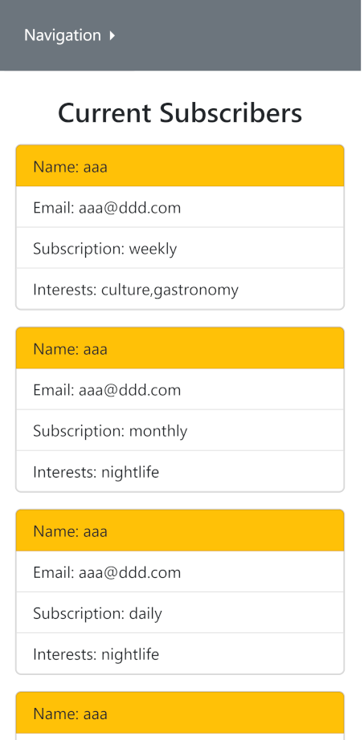

# Practice - form validation with JS, saving and retrieving information from Local Storage

## Description

A little repeat practise to get comfortable with JS form validation, JSON and Local Storage, and Bootstrap elements.

Points of interest - notes to self:
* Saving and retrieving object entry that is **an array** from a checklist where user can tick various options.
* Creating and appending lists in HTML using JS Dom.
* Design was done mobile-first (so far, mobile only).

## Tools

*VS Code
*Bootstrap 5.2

## Author

*kbastamow
